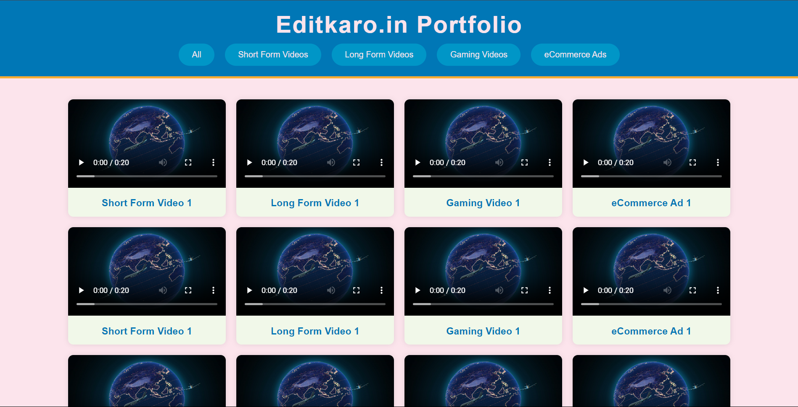
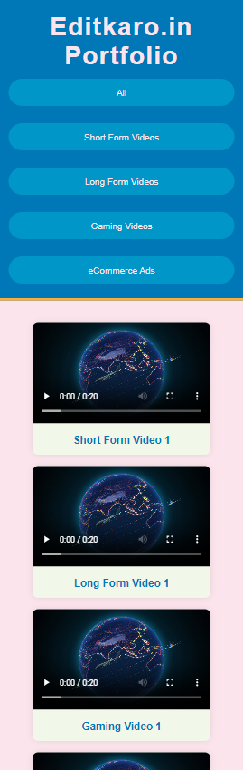

# Editkaro.in Portfolio

## Overview
This project is an interactive and dynamic portfolio webpage created for **Editkaro.in**, a social media marketing and video editing agency. The portfolio showcases various categories of work including:
- Short-form videos
- Long-form videos
- Gaming videos
- Football edits
- eCommerce ads
- Documentary-style videos
- Color grading
- Anime videos
- Advertisements

The webpage is designed to be visually engaging and fully responsive for both mobile and desktop views.

## Features
- **Dynamic Filtering**: Users can filter videos by category using the navigation bar.
- **Responsive Design**: The layout adapts to different screen sizes, ensuring a seamless experience on mobile and desktop.
- **Video Previews**: Each video can be previewed directly on the page.

## Technologies Used
- **HTML**: For structuring the content.
- **CSS**: For styling the webpage.
- **JavaScript**: For interactivity and functionality.

## Setup Instructions
1. **Clone the Repository**:
   ```bash
   git clone https://github.com/TenEplaysOfficial/editkaro-portfolio.git
   cd editkaro-portfolio
   ```

2. **Open the `index.html` file**:
   You can open the `index.html` file directly in your browser to view the portfolio.

3. **Make Sure to Add Video Files**:
   Ensure that the video files are placed in the `assets/videos/` directory as referenced in the code.

## Usage
- Click on the navigation links to filter the videos by category.
- Use the video controls to play, pause, or adjust volume.

## Screenshots
Here are some screenshots of the portfolio webpage:

### Desktop View


### Mobile View


## Contribution
Feel free to fork the repository and make improvements or suggestions. Contributions are welcome!

## License
This project is licensed under the MIT License - see the [LICENSE](LICENSE) file for details.

*Stay connected! Follow me on [Socials](https://linktr.ee/tenegames).*